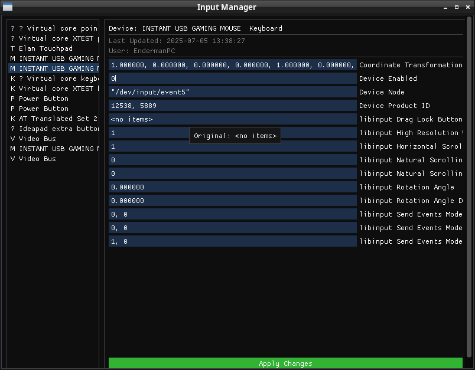
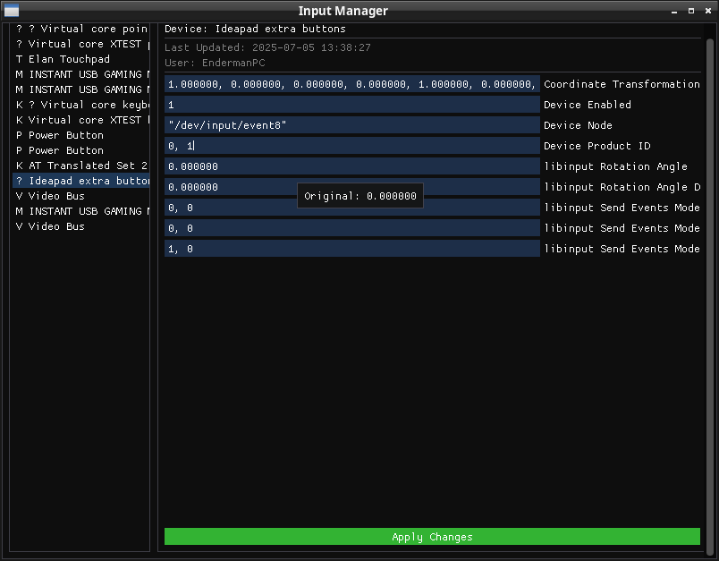

# Easy Input Manager

A cross-platform graphical tool for managing input devices (xinput/libinput) with real-time configuration capabilities.




## Features

- 🖱️ Real-time input device management
- ⚙️ Visual configuration interface
- 🔄 Live property updates
- 🎮 Support for multiple input devices
- 🔐 Secure settings application (using polkit)
- 📱 Responsive UI design

## Prerequisites

### Linux
```bash
# Ubuntu/Debian
sudo apt-get install cmake g++ libsdl2-dev policykit-1

# Fedora
sudo dnf install cmake gcc-c++ SDL2-devel polkit

# Arch Linux
sudo pacman -S cmake gcc sdl2 polkit
```

## Building from Source

1. Clone the repository:
```bash
git clone https://github.com/EndermanPC/EasyInputManager.git
cd EasyInputManager
```

2. Download ImGUI:
```bash
git clone https://github.com/ocornut/imgui.git imgui
```

3. Create build directory and compile:
```bash
mkdir build
cd build
cmake ..
make
```

## Usage

Run the application:
```bash
./EasyInputManager
```

### Interface Guide

- **Left Panel**: Lists all detected input devices
- **Main Panel**: Shows device properties and configuration options
- **Property Fields**: Edit values directly in the text fields
- **Apply Button**: Appears when changes are made and needs confirmation

### Making Changes

1. Select a device from the left panel
2. Modify desired properties in the main panel
3. Click "Apply Changes" to save modifications
4. Authenticate when prompted (uses polkit)

## Project Structure

```
EasyInputManager/
├── include/
│   ├── app.h                    # Application header
│   └── devicemanager.h          # Device management header
├── src/
│   ├── main.cpp                 # Application entry point
│   ├── app.cpp                  # Main application logic
│   └── devicemanager.cpp        # Device management implementation
├── imgui/                       # Dear ImGui folder
├── build/                       # Build directory
├── images/                      # Screenshot
└── CMakeLists.txt               # CMake configuration
```

## Contributing

1. Fork the repository
2. Create your feature branch (`git checkout -b feature/amazing-feature`)
3. Commit your changes (`git commit -m 'Add some amazing feature'`)
4. Push to the branch (`git push origin feature/amazing-feature`)
5. Open a Pull Request

## License

This project is licensed under the MIT License - see the [LICENSE](LICENSE) file for details.

## Acknowledgments

- [Dear ImGui](https://github.com/ocornut/imgui) - Immediate Mode Graphical User Interface
- [SDL2](https://www.libsdl.org/) - Simple DirectMedia Layer
- All contributors and users of the project

## Version History

- 1.0.0 (2025-07-05)
  - Initial release
  - Basic device management
  - Real-time configuration
  - Polkit integration

## Support

For support, please open an issue in the GitHub repository or contact the maintainers.

---
Last updated: 2025-07-05 13:56:34 UTC by EndermanPC
